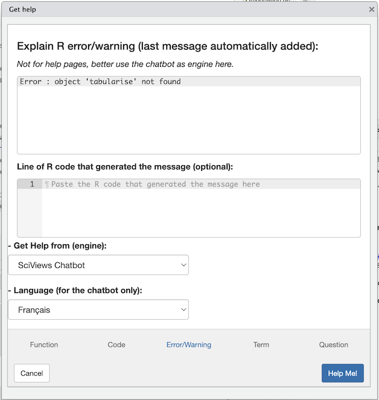

```{r setup, include=FALSE}
BioDataScience3::learnr_setup()
SciViews::R("model", "explore", "ml")

# dataset
crabs <- read("crabs", package = "MASS", lang = "fr")
```

```{r, echo=FALSE}
BioDataScience3::learnr_banner()
```

```{r, context="server"}
BioDataScience3::learnr_server(input, output, session)
```

------------------------------------------------------------------------

## Objectifs

Ce cours de [Science des données III : exploration et prédiction](https://wp.sciviews.org/sdd-umons3/) fait suite aux cours de [Science des données I : visualisation et inférence](https://wp.sciviews.org/sdd-umons/) et [Science des données II : analyse et modélisation](https://wp.sciviews.org/sdd-umons2/). Ce tutoriel vise à :

-   Réviser les notions essentielles du cours de Science des données I et II
-   Introduire les nouveautés dans la SciViews Box 2024

Le cours de Science des données I se divise en deux parties. La première partie traite principalement de la réalisation de graphiques et du remaniement des données. La seconde partie s'intéresse aux probabilités, aux distributions statistiques les plus courantes en biologie ainsi qu'aux tests d'inférence (test *t* de Student, test de Wilcoxon, ANOVA, test de Kruskal-Wallis...)

Le cours de Science des données II se divise également en deux parties. La première partie porte sur la modélisation linéaire et non linéaire. La seconde partie se concentre sur les statistiques exploratoires avec des méthodes ayant pour objectif de réduire la dimensionnalité comme l'analyse en composante principale ou de regrouper des individus comme la classification hiérarchique ascendante. D'autres méthodes sont également abordées.

Ce tutoriel ne peut s'attarder sur chaque aspect des 20 modules des deux cours précédents. Il est nécessairement une synthèse, mais son utilité réside dans une auto-évaluation de vos connaissances de ces cours avant d'aborder la matière du troisième. Si vous n'arrivez pas à répondre aux questions de ce tutoriel, une révision des cours précédents est indispensable.

## Chargement de packages

La fonction`SciViews::R()` est employée pour charger une série cohérente de packages R. Nous l'utilisons en début de script R ou encore dans le premier chunk de setup d'un rapport d'analyse au format R Markdown (nous utiliserons également des documents au format Quarto, très similaires si ce n'est au niveau du contenu de l'entête YAML).

Les packages R ainsi chargés permettent d'importer, remanier et visualiser à l'aide de graphiques sans devoir employer en plus la fonction `library()` pour charger d'autres packages supplémentaires (mais vous pourriez être amené à le faire occasionnellement).

Exécutez l'instruction `SciViews::R()` suivie de l'instruction `SciViews_packages()` dans la console R ci-dessous et analysez le résultat obtenu. Rappelez-vous que pour exécuter et tester votre code vous cliquez sur le bouton `Run Code` et pour soumettre votre réponse (il faut que le code soit correct pour en obtenir une, naturellement), vous cliquez sur le bouton `Submit Answer`. Utilisez autant de fois que nécessaire `Run Code` sans pénalité, mais n'oubliez surtout pas de soumettre à la fin avec `Submit Answer`.

```{r sciviews-noscore, exercise=TRUE}

```

```{r sciviews-noscore-solution}
SciViews::R()
SciViews_packages()
```

```{r sciviews-noscore-check}
grade_code("Vous voyez qu'un certain nombre de packages R sont chargés. Répondez à la question ci-dessous.")
```

```{r qu_sciviews}
question("Parmi ces packages R, lesquels sont chargés avec l'instruction `SciViews::R()`",
  answer("chart", correct = TRUE),
  answer("tidyverse"),
  answer("data.table", correct = TRUE),
  answer("data.io", correct = TRUE),
  answer("collapse", correct = TRUE),
  allow_retry = TRUE, random_answer_order = TRUE,
  correct = "C'était une petite question d'échauffement liée à la lecture de sortie R.",
  incorrect = "Attention, relisez attentivement le résultat renvoyé par `SciViews_packages()`. Plusieurs éléments sont à sélectionner.",
  submit_button = "Soumettre une réponse", try_again_button = "Resoumettre une réponse"
    )
```

Des packages supplémentaires peuvent être chargés grâce à `SciViews::R()`. Ils correspondent à des sections complémentaires qui ne sont pas chargées de base, par exemple, `"model"` pour la modélisation, `"infer"` pour l'inférence, `"ml"` pour le machine learning, `"ts"` pour les séries spatio-temporelles, `"explore"` pour l'exploration multivariée, "spatial" pour les données géoréférencées... Il est également possible de définir le langage par défaut pour l'importation de données qui supportent plusieurs langages et pour les labels automatiques des axes des graphiques via l'argument `lang=`.

Vous remarquerez que l'instruction `SciViews::R` ne génère plus de sortie à présent. Avant, vous aviez un long listing des packages changés et ensuite des conflits entre fonctions. Ceci est rendu silencieux, mais vous pouvez toujours préciser l'argument `silent = FALSE`, donc avec `SciViews::R(silent = FALSE)` pour retrouver le rapport auquel vous êtes habitué.

```{r, echo=TRUE, eval=FALSE}
SciViews::R("model", lang = "fr")
```

## Importation des données

Dans SciViews-R, la fonction `read()` se charge de l'importation de données depuis les packages R (argument `package=`), depuis le disque dur, ou depuis Internet. Consultez la page d'aide de cette fonction pour en découvrir d'autres arguments utiles avec `?read`.

Importez le tableau nommé `crabs` qui provient du package {MASS}. **rappel : lorsqu'un exercice comporte du code avec des zones à remplacer (`___`), ne faites rien d'autre que compléter ces zones. Les outils d'autocorrection sont très sensibles et n'apprécieraient pas autrement.**

```{r read_h2, exercise=TRUE, warning=FALSE}
crabs <- read(___, package = ___)
# Tableau partiel 
tabularise$headtail(crabs)
```

```{r read_h2-hint-1}
# Consultez la page d'aide de read(). 
# Elle est disponible en exécutant l'instruction `?` ou encore `.?` dans la console R..
crabs <- read(___, package = ___)
# Tableau partiel 
tabularise$headtail(crabs)

 #### ATTENTION: Hint suivant = solution !####
```

```{r read_h2-solution}
## Solution ##
crabs <- read("crabs", package = "MASS")
# Formatage du tableau crabs
tabularise$headtail(crabs)
```

```{r read_h2-check}
grade_code("Vous avez importé le jeu de données dans R.", "Il semble que la réponse ne soit pas la bonne. Ne complétez que les élèments manquants marqué ___. Consultez la page d'aide de la fonction read() si nécessaire.")
```

{width="30%"}

Dans la SciViews Box 2024, vous avez maintenant un nouvel "addin" dans RStudio, nommé **"Help"**.


Il donne accès à diverses pages d'aides sur les fonctions R, le code, les messages d'erreurs ou plus généralement des termes statistiques, voire n'importe quelle question que vous vous posez. Vous pouvez utilise l'aide de R (**Help pages**), mais aussi interroger un moteur LLM de type ChatGPT spécialement entrainé pour répondre à des questions de statistique, de science des données ou relatives au langage R (**SciViews chatbot**), aussi bien en anglais qu'en français. Enfin, vous pourrez aussi interroger Internet avec un moteur de recherche spécialisé pour R (**Rseek**), dans un forum autour de questions de programmation (**Stack Overflow**), ou plus généralement à l'aide des moteurs **Google**, **Bing** ou **DuckDuckGo**.



**Le chatbot SciViews ne connait que les fonctions et la syntaxe R de base ou tidyverse. Il ne connait pas le dialecte SciViews-R. Mais dans les exercices, nous vous demandons d'utiliser ce dernier sous peine de pénalité dans les exercices. Il vous faudra donc convertir le code renvoyé par ce chatbot, ou n'importe quel autre moteur LLM en code SciViews-R.** Ceci à titre didactique pour bien montrer que vous *comprenez* votre code et que vous ne copiez-collez pas "bêtement" un résultat renvoyé par un moteur LLM (bien entendu, hors de ce cours, vous êtes libre d'utiliser la syntaxe R qui vous plait). Dans la suite de ce tutoriel learnr, nous allons revenir sur les spécificités du dialecte SciViews-R pour vous rafraîchir la mémoire à ce sujet.

Le package {tabularise} est disponible dans la SciViews Box 2024. Ce package a une fonction centrale que vous devez retenir `tabularise()`. Elle permet d'obtenir des tableaux bien formatés pouvant être ajoutés à vos carnets de notes et vos rapports. Cette fonction utilise la structure suivante : `tabularise\$xxx(objet)`. En fonction du type indiqué dans `xxx` et de la classe de l'objet, vous obtiendrez un tableau spécifique. Dans l'exemple ci-dessus, vous avez employé le type `headtail` qui permet d'afficher le début et la fin de votre tableau de données.

La fonction `read()` permet d'importer un nombre important de formats de fichiers. Avec l'instruction suivante, vous pouvez retrouver tous les formats supportés par la fonction `read()` (et par son pendant pour exporter vos données, la fonction `write()`).

```{r, echo=TRUE}
data_types(view = FALSE)
```

À présent, vous allez utiliser la même fonction pour importer un jeu de données présent sur votre disque. Analysez l'organisation des fichiers ci-dessous. Le dossier `sharks-GuyliannEngels` contient tous les documents employés afin de réaliser une analyse sur le recensement des attaques de requins en Australie. Il s'agit d'un [projet RStudio](https://wp.sciviews.org/sdd-umons/?iframe=wp.sciviews.org/sdd-umons-2024/rs.html). Ce projet doit absolument être portable. Il faut donc employer uniquement des [chemins relatifs](https://wp.sciviews.org/sdd-umons/?iframe=wp.sciviews.org/sdd-umons-2024/rs.html%23chemins-relatifs). Par exemple, le document `sharks_report.Rmd` se trouve dans le sous-dossier `docs`.

    /home
      /sv
        /shared
          /projects
            /sharks-GuyliannEngels        # Répertoire de base du projet
              .gitignore                  # Fichier lié à la gestion de version
              /data                       # Dossier avec les données
                sharks.csv                # Fichier d'un jeu de données
              /docs                       # Dossier avec les analyses
                sharks_report.Rmd         # Fichier rapport au format Rmd
              /R                          # Dossier avec les scripts d'analyse
                sharks_import.R           # Script R nommé sharks_import.R
              sharks-GuyliannEngels.Rproj # Fichier de configuration du projet

```{r qu_read}
quiz(
  question("Depuis le fichier sharks_report.Rmd, sélectionnez l'instruction R correcte afin de lire le je de données `sharks.csv`.",
    answer("sharks <- read(\"../data/sharks.csv\")", correct = TRUE),
    answer("sharks <- read(\"sharks.csv\")"),
    answer("sharks <- read(\"data/sharks.csv\")"),
    answer("sharks <- read(\"../../data/sharks.csv\")"),
    answer("sharks <- read(\"../data/sharks_import.R\")"),
    allow_retry = TRUE, random_answer_order = TRUE,
    submit_button = "Soumettre une réponse", try_again_button = "Resoumettre une réponse",
    correct = "Le chemin d'accès relatif part du dossier contenant le fichier .Rmd.",
    incorrect = "Attention, il faudrait peut-être réviser la partie relative aux chemins relatifs (voir lien plus haut)."
    ),
  question("Depuis le fichier sharks_import.R, sélectionnez l'instruction R correcte afin de lire le jeu de données `sharks.csv`.",
    answer("sharks <- read(\"../data/sharks.csv\")"),
    answer("sharks <- read(\"sharks.csv\")"),
    answer("sharks <- read(\"data/sharks.csv\")", correct = TRUE),
    answer("sharks <- read(\"../../data/sharks.csv\")"),
    answer("sharks <- read(\"../data/sharks_import.R\")"),
    allow_retry = TRUE, random_answer_order = TRUE,
    submit_button = "Soumettre une réponse", try_again_button = "Resoumettre une réponse",
    correct = "Le script R utilise comme point de départ le dossier de base contenant le projet RStudio, alors que le .Rmd part du dossier qui l'héberge.",
  incorrect = "Vous devez, semble-t-il, réviser le cours en ce qui concerne les projets RStudio et les chemins relatifs."
    )
  )
```

La [section 4.1 du cours de SDD I](https://wp.sciviews.org/sdd-umons/?iframe=wp.sciviews.org/sdd-umons-2024/importation-des-donn%25C3%25A9es.html) traite de l'importation des données dans R. Consultez également cette dernière au besoin.

-   Rappel concernant les types de fichiers : les blocs-notes et les rapports seront rédigés sous forme de documents **[Quarto](https://quarto.org)** (certains peuvent encore être au format R Markdown, toutefois). L'extension de fichier est `.qmd` (contre `.Rmd` pour R Markdown). Il y a relativement peu de changements dans l'utilisation de ce format par rapport à R Markdown, à part dans l'entête YAML. Cet entête sera en grande partie prérédigé pour vous dans les projets, donc, pas de panique !

-   Par rapport à l'exercice ci-dessus, vous remarquerez que les blocs-notes et les rapports ne seront plus dans le sous-dossier `/docs` dans vos projets, mais directement à la racine. Deux raisons à cela : étant les documents clés du projet, ils sont plus facilement gérés depuis sa racine, et seconde raison, le dossier courant du document Quarto est ainsi le même que le dossier courant du projet (à la console R). C'est plus facile à gérer (chemins relatifs identiques pour les scripts R et les rapports, cf. exercice juste au-dessus qui rappelle le piège lorsque le fichier R Markdown est dans un sous-dossier du projet) !

-   Et tant que nous évoquons la rédaction de rapport, de nouveaux outils font leur apparition. Vous avez déjà découvert `tabularise()` pour obtenir de beaux tableaux. Il y a aussi de nouvelles fonctions pour générer des équations mathématiques (fonctions `equation()`, `eq_()` et `eq__()`). Vous les utiliserez dans le cadre de vos régressions linéaires...

Voici par exemple un tableau de l'analyse de variance avec `tabularise` :

```{r, echo=TRUE, warning=FALSE}
SciViews::R("model") # La section 'model' est nécessaire pour les extensions ANOVA
# Préparation des données
tg <- read("ToothGrowth", package = "datasets")
tg$dose <- as.factor(tg$dose)
# ANOVA à deux facteurs
tg_anova <- anova(lm(data = tg, len ~ supp * dose))
# Tableau de l'ANOVA avec tabularise
tabularise(tg_anova, lang = "fr")
```

## Visualisation des données

Plusieurs moteurs graphiques sont utilisables dans R pour réaliser vos graphiques : {ggplot2}, {lattice} ou encore, graphiques de base de R. Une comparaison des moteurs graphiques est réalisée dans la [section 3.5 du cours de SDD I](https://wp.sciviews.org/sdd-umons/?iframe=wp.sciviews.org/sdd-umons-2024/diff%25C3%25A9rents-moteurs-graphiques.html)

Avec le dialecte `SciViews::R`, la fonction centrale pour réaliser des graphiques est `chart()` à laquelle on va ajouter une série de couches en utilisant l'opérateur `+` comme illustré ci-dessous.

```{r, echo=TRUE}
# Importation des données
crabs <- read("crabs", package = "MASS")

chart(data = crabs, length ~ width %col=% sex | species) +
  geom_point()
```

Il n'est pas aisé de se souvenir du nom de chaque fonction que l'on peut employer avec `chart()` ou `ggplot()`. Nous vous proposons pour ce faire une syntaxe alternative. La fonction `Sgg$` associée au pipe natif de R `|>` permet d'obtenir une liste de toutes les fonctions disponibles que l'on peut ajouter au graphique. Le pipe `|>` va remplacer le `+` que l'on suit par `Sgg$` et une liste de complétion apparaît. Il s'agit des fonctions habituelles comme `geom_point()` par exemple :

```{r, echo=TRUE}
chart(data = crabs, length ~ width %col=% sex | species) |>
  Sgg$geom_point()
```

**Attention !** Il n'est pas possible d'intervertir le `+` et `|>` dans chaque situation. Le pipe natif de R `|>` se combine uniquement avec `Sgg$`.


```{r, echo=TRUE, eval=FALSE}
# Mauvaise forme 
chart(data = crabs, length ~ width %col=% sex | species) |>
  geom_point()
```

Reproduisez le graphique suivant en utilisant la syntaxe `Sgg()`. Il s'agit de boites à moustaches (*boxplot*, en anglais).

```{r}
# Importation des données
crabs <- read("crabs", package = "MASS")
# Graphique
chart(data = crabs, length ~ sex %fill=% species) +
  geom_boxplot()
```

Les variables à votre disposition sont les suivantes :

`r paste0("<code>", names(crabs), "</code>")`

```{r chart_h4, exercise=TRUE}
# Importation des données
crabs <- read("crabs", package = "MASS")
# Graphique
chart(data = ___, ___ ~ ___ %___=% ___ ) ___
  Sgg$___
```

```{r chart_h4-hint-1}
# Importation des données
crabs <- read("crabs", package = "MASS")
# Graphique
chart(data = ___, ___ ~ ___ %___=% ___ ) |>
  Sgg$geom____
```

```{r chart_h4-hint-2}
# Importation des données
crabs <- read("crabs", package = "MASS")
# Graphique
chart(data = ___, ___ ~ ___ %___=% ___ ) |>
  Sgg$geom_b___
```

```{r chart_h4-hint-3}
# Importation des données
crabs <- read("crabs", package = "MASS")
# Graphique
chart(data = crabs, length ~ ___ %fill=% ___ ) |>
  Sgg$geom_box___

 #### ATTENTION: Hint suivant = solution !####
```

```{r chart_h4-solution}
## Solution ##
# Importation des données
crabs <- read("crabs", package = "MASS")
# Graphique
chart(data = crabs, length ~ sex %fill=% species ) |>
  Sgg$geom_boxplot()
```

```{r chart_h4-check}
grade_code("Vous êtes capable d'employer la formule dans `chart()`, ainsi que le bon `geom_*()` afin d'obtenir des boites de dispersion.")
```

```{r qu_chart}
question("Sélectionnez parmi les éléments suivants, les descriptions graphiques correctes (plusieurs éléments peuvent être cochés).",
  answer("Les médianes des longueurs des carapaces des crabes oranges sont supérieures aux crabes bleus.", correct = TRUE),
  answer("Les moyennes des longueurs des carapaces des crabes oranges sont supérieures aux crabes bleus."),
  answer("Les espaces interquartiles sont similaires entre les quatre groupes.",correct = TRUE),
  answer("Les écart-types sont similaires entre les quatre groupes."),
  allow_retry = TRUE, random_answer_order = TRUE,
  submit_button = "Soumettre une réponse", try_again_button = "Resoumettre une réponse",
  correct = "Bonne interprétation du graphique. Notez ici que les couleurs par défaut sont trompeuses : l'orange pour les crabes bleus et le bleu-vert pour les crabes oranges... ce n'est franchement pas idéal du tout. Nous verrons un peu plus loin comment corriger cela.",
  incorrect = "Attention, n'auriez vous pas mélangé les descripteurs paramétriques et les descripteurs non paramétriques ? La boite de dispersion présente les descripteurs non paramétriques. La section 4.3 de SDD I traite spécifiquement des boites de dispersion.")
```

Les modules 1 à 3 du cours [SDD I](https://wp.sciviews.org/sdd-umons) traitent de la réalisation des graphiques dans R avec `chart()`. Révisez ces modules au besoin.

## Remaniement des données

Le remaniement de données est tout un art que vous devez maîtriser à la perfection. Vous devez être capable de détecter les valeurs manquantes, de filtrer des observations, de sélectionner des colonnes d'intérêt, de calculer de nouvelles variables. Ces outils de remaniement sont cruciaux dans la classification supervisée que nous découvrirons ensemble dans ce cours de SDD III.

Dans la SciViews Box 2024, l'utilisation des **data.frame**s, **data.table**s et **tibble**s, trois objets très similaires pour représenter un jeu de données, a été simplifiée. Dans la box 2022, avec les **data.table**s et les fonctions **tidy** comme `mutate()`, `select()`, etc., vous étiez confrontés à des difficultés liées l'utilisation automatique de "lazy data" : les calculs ne se faisaient pas directement. Ils devaient parfois être **"collectés"** à l'aide de `collect_dtx()` ou de l'assignation alternative `%<-%` ou `%->%`. Ces difficultés vous ont joué bien des tours. Dans la box 2023, *cela n'est plus nécessaire*, et même sans `collect_dtx()` ou avec l'assignation classique `<-`, vous obtenez toujours un **data.table**.

Pour fixer les idées, nous pouvons décider de regrouper les fonctions de R en familles selon leur comportement. Les fonctions d'une même famille ont un comportement similaire du point de vue des arguments qu'elles acceptent, du type d'objet qu'elles utilisent et de la façon de renvoyer les résultats.

Le [Tidyverse](https://www.tidyverse.org) propose un ensemble de fonctions cohérentes autour des objets **tibble**s. Ce sont les fonctions comme `mutate()`, `select()`, `filter()`, `group_by()`, `summarise()`, `pivot_longer()`,... Nous appellerons cette famille les **fonctions tidy**.

Depuis la SciViews Box 2022, il existe des fonctions jumelles aux précédentes qui se comportent de manière très proche et qui réalisent le même traitement dans 95% des cas, mais qui sont nettement plus rapides. Pour cette raison, nous appellerons cette famille, les **fonctions speedy**. Leur nom est identique aux fonctions "tidy", mais préfixé d'un `"s"` pour les différencier. Donc, l'homologue de `mutate()` est `smutate()`, `filter()` devient `sfilter()`, et ainsi de suite...

```{r, echo=TRUE}
list_speedy_functions()
```

En résumé, on retrouve un équivalent aux cinq fonctions "tidy" principales du package {dplyr} mais sous forme "speedy". Les arguments des fonctions et les résultats renvoyés sont très similaires :

-   sélectionner des colonnes au sein d'un jeu de données avec `select()`/`sselect()`
-   filtrer des lignes dans un jeu de données avec `filter()`/`sfilter()`
-   calculer de nouvelles variables dans un jeu de données avec `mutate()`/`smutate()`
-   indiquer les variables de regroupement à utiliser dans un tableau avec `group_by()`/`sgroup_by()`
-   résumer les variables d'un jeu de données avec `summarise()`/`ssummarise()`

*Nous vous conseillons d'employer préférentiellement les fonctions speedy pour un travail sur des jeux de données allant jusqu'à quelques dizaines de milliers de lignes, voire plus.*

**Les différents pipes** : Le pipe natif `|>` est apparu dans la version 4.1.0 de R. Vous connaissez déjà deux opérateurs de pipe que sont le pipe de {magrittr} `%>%` et le pipe de {svFlow} `%>.%` dans SciViews-R. Ces trois opérateurs permettent de chaîner des instructions afin de montrer de manière claire la suite des opérations. Les pipes améliorent grandement la lisibilité du code. Notez que le pipe `|>` ne requiert pas l'utilisation du `.` dans la fonction qui le suit alors que le pipe `%>.%` l'impose. Il est appelé **pipe explicite** pour cette raison. Vous pouvez retrouver de plus amples informations sur le chaînage des instructions dans la [section 4.5 de SDD I](https://wp.sciviews.org/sdd-umons/?iframe=wp.sciviews.org/sdd-umons-2024/cha%25C3%25AEnage-des-instructions.html).

*Nous vous proposons de continuer à utiliser le pipe `%>.%` de SciViews-R lors de vos remaniements de données.*

Exercice pratique : sélectionnez les crabes ayant une longueur de carapace strictement supérieure à 32 mm et dont la largeur est inférieure ou égale à 42. Utilisez la fonction "speedy" adéquate.

```{r filter_h3, exercise=TRUE}
# Importation des données
crabs <- read("crabs", package = "MASS")
# Réduction du tableau
crabs_red <- ___(crabs, ___ ___ ___ & ___ <= 42)
```

```{r filter_h3-hint-1}
# Importation des données
crabs <- read("crabs", package = "MASS")
# Réduction du tableau
crabs_red <- sfilter(crabs, ___ ___ ___ & ___ <= 42)
```

```{r filter_h3-hint-2}
# Importation des données
crabs <- read("crabs", package = "MASS")
# Réduction du tableau
crabs_red <- sfilter(crabs, ___ ___ ___ & width <= 42)

 #### ATTENTION: Hint suivant = solution !####
```

```{r filter_h3-solution}
## Solution ##
# Importation des données
crabs <- read("crabs", package = "MASS")
# Réduction du tableau
crabs_red <- sfilter(crabs, length > 32 & width <= 42)
```

```{r filter_h3-check}
grade_code("Vous avez employé correctement la fonction sfilter().", "Il semble que vous ayez commis une erreur. N'hésitez pas à revoir la section 4.4.2 de SDD I.")
```

Pour résumer les données par espèce et par sexe, toujours en utilisant les fonctions speedy, vous feriez :

```{r, echo=TRUE}
# Utilisation des fonctions speedy
crabs %>.%
  sgroup_by(., species, sex) %>.%
  ssummarise(.,
    length_mean = fmean(length),
    length_sd   = fsd(length),
    n           = fn(length)) ->
  crabs_red
```

Les fonctions en R de base peuvent être employées afin de réaliser des calculs comme la somme, la moyenne, la variance sur des vecteurs ou des matrices. Ces fonctions ont une version équivalente dans une troisième famille de fonctions que nous vous faisons découvrir ici, **les fonctions "fast"** :

-   calculer la moyenne : `mean()`/`fmean()`
-   calculer l'écart-type : `sd()`/`fsd()`
-   déterminer le minimum : `min()`/`fmin()`
-   déterminer le maximum : `max()`/`fmax()`
-   calculer de la médiane : `median()`/`fmedian()`
-   ...

*Nous vous conseillons d'employer préférentiellement les fonctions "fast" qui sont plus rapides comme leur nom le suggère, mais qui ont également d'autres qualités intéressantes, notamment de s'appliquer directement et intelligemment sur des data frames.*

```{r, echo=TRUE}
list_fstat_functions()
```

Complétez maintenant le code ci-dessous pour calculer un tableau résumé reprenant la médiane, la longueur minimale, la longueur maximale et le nombre d'observations de la longueur de la carapace des crabes regroupés par espèce et par sexe. Utilisez les fonctions "speedy" et "fast" dans votre code. Pour rappel, les variables de `crabs` sont :

`r paste0("<code>", names(crabs), "</code>")`

```{r summarise_h3, exercise=TRUE, exercise.lines=7}
crabs %>.%
  ___(., species, ___) ___
  ___(.,
    length_med = ___(___), length_min = ___(___), 
    length_max = ___(___), n = ___(___)) ->
  crabs_red
crabs_red
```

```{r summarise_h3-hint-1}
crabs %>.%
  ___(., species, sex) ___ 
  ___(.,
    length_med = ___(___), length_min = ___(___), 
    length_max = ___(___), n = ___(___)) ->
  crabs_red
crabs_red
```

```{r summarise_h3-hint-2}
crabs %>.%
  sgroup_by(., species, sex) %>.%
  ssummarise(.,
    length_med = fmedian(___), length_min = ___(___), 
    length_max = ___(___), n = ___(___)) ->
  crabs_red
crabs_red
 #### ATTENTION: Hint suivant = solution !####
```

```{r summarise_h3-solution}
## Solution ##
crabs %>.%
  sgroup_by(., species, sex) %>.%
  ssummarise(.,
    length_med = fmedian(length), length_min = fmin(length), 
    length_max = fmax(length), n = fnobs(length)) ->
  crabs_red
crabs_red
```

```{r summarise_h3-check}
grade_code("Vous avez compris la syntaxe et l'utilisation des fonctions speedy et fast.", "Il semble que vous ayez commis une erreur. Nous vous conseillons de revoir le module 5 de SDD I ainsi que les explications ci-dessus.")
```

## Analyse de variance

L'analyse de variance (ANOVA) permet de déterminer si la valeur moyenne d'une variable numérique (variable réponse) est significativement différente dans au moins une des sous-populations étudiées. Ces sous-populations sont définies par une ou plusieurs variables qualitatives (variables de classe **factor** ou **ordered**). Nous allons nous intéresser à l'épaisseur des crabes. Il est évident qu'un crabe plus grand sera aussi plus épais. Nous allons diviser l'épaisseur par la longueur de la carapace afin de considérer un facteur de forme (ratio) plutôt qu'une dimension absolue. Ensuite, nous considérerons la puissance cinq de ce ratio comme transformation qui normalise au mieux les données (suite à différents essais non présentés ici par souci de concision).

```{r, echo=TRUE}
crabs2 <- smutate(crabs, depth_len5 = (depth/length)^5 |>
    labelise("(épaisseur / longueur)^5", units = ""))

chart(data = crabs2, depth_len5 ~ sex %fill=% species) +
  geom_boxplot()
```

Construisez un modèle ANOVA complet pour étudier cette variable `depth_len5` à la fois en fonction de l'espèce et du sexe. Normalement, il est utile de simplifier un modèle si des paramètres sont non significatifs, mais ici, vous conserverez le modèle complet.

Des graphiques génériques `chart()` sont disponibles dans le package {modelit} afin d'analyser la distribution normale des résidus d'un objet de classe **lm**. Consultez la page d'aide `?chart.lm` afin de vous remémorer le type à utiliser (`chart$type()`) pour ces graphiques.

```{r, echo=TRUE, eval=FALSE}
# un objet de type `lm`
lm1
# Graphyque quantile-quantile des résidus avec le package {modelit}
chart$qqplot(lm1)
```

N'oubliez pas que dans les conditions d'application de l'ANOVA, il faut que les résidus aient une distribution normale et que la variance soit constante d'une sous-population à l'autre (homoscédasticité). En pratique, il faut naturellement suffisamment de points de mesure (une trentaine minimum pour donner un ordre de grandeur) pour pouvoir le vérifier. Par ailleurs, l'ANOVA est relativement robuste à des petites dérives à ce niveau.

```{r anova_prep}
crabs <- read("crabs", package = "MASS")
crabs2 <- smutate(crabs, depth_len5 = (depth/length)^5)
```

```{r anova_h3, exercise=TRUE, exercise.setup="anova_prep"}
# Réalisation de l'ANOVA
anova(crabs_lm <- lm(data = ___, ___ ~ ___))
# Vérification de l'homoscédasticité
bartlett.test(data = ___, ___ ~ interaction(___, ___))
# Vérification de la distribution normale des résidus
chart$___(___)
```

```{r anova_h3-hint-1}
# Réalisation de l'ANOVA
anova(crabs_lm <- lm(data = crabs2, depth_len5 ~ ___))
# Vérification de l'homoscédasticité
bartlett.test(data = ___, ___ ~ interaction(___, ___))
# Vérification de la distribution normale des résidus
chart$qqplot(___)
```

```{r anova_h3-hint-2}
# Réalisation de l'ANOVA
anova(crabs_lm <- lm(data = crabs2, depth_len5 ~ ___ * ___))
# Vérification de l'homoscédasticité
bartlett.test(data = ___, ___ ~ interaction(___, sex))
# Vérification de la distribution normale des résidus
chart$qqplot(___)

 #### ATTENTION: Hint suivant = solution !####
```

```{r anova_h3-solution}
## Solution ##
# Réalisation de l'ANOVA
anova(crabs_lm <- lm(data = crabs2, depth_len5 ~ species * sex))
# Vérification de l'homoscédasticité
bartlett.test(data = crabs2, depth_len5 ~ interaction(species, sex))
# Vérification de la distribution normale des résidus
chart$qqplot(crabs_lm)
```

```{r anova_h3-check}
grade_code("Cette ANOVA à deux facteurs peut se simplifier parce que l'effet 'sex' n'est pas significatif au seuil alpha de 5%. Néanmoins, les interactions sont très légèrement significatives au même seuil. Avec notre transformation puissance cinq, les résidus ont une distribution normale et une variance constante, atestée par une valeur p du test de Batlett supérieur au seuil alpha de 5%. Ici, comme nous avons deux sous-populations, les tests pot hoc ne sont pas nécessaires, mais assurez-vous de bien les maîtriser également.", "Votre code n'est pas correct. Respecter l'ordre des variables, species avant sex et le noms des autres objets.")
```

## Modèle linéaire

La modélisation permet de créer une représentation mathématique simplifiée de la relation entre deux ou plusieurs variables numériques sous forme d'une fonction mathématique. Nous ne revenons pas sur la différence entre corrélation, relation et causalité. Si vous avez une hésitation sur la différence entre ces termes, consultez la [section 1.1.2 de SDD II](https://wp.sciviews.org/sdd-umons2/?iframe=https://wp.sciviews.org/sdd-umons2-2024/modèle.html%23quand-modéliser). La fonction utilisée pour ajuster un modèle linéaire est `lm()`.

Votre objectif est d'étudier la relation entre l'épaisseur du corps des crabes en fonction de la longueur de leur carapace pour chaque espèce. La première chose à faire est de tracer le graphique en nuage de points. Une petite astuce ici : la première couleur du graphique est rouge-orange et la seconde un vert-bleu. Par contre, on a l'espèce bleue qui est avant l'espèce orange ("B" avant "O" par ordre alphabétique). Donc, sans précautions particulières, on aurait l'espèce bleue représentée en rouge-orange et l'espèce orange en vert-bleu, comme c'était le cas au début de ce tutoriel pour le graphique en boites à moustaches. Nous allons donc inverser les niveaux de la variable `species` à l'aide de `fct_relevel()`. Nous aurions aussi bien pu changer la palette de couleurs utilisée, bien entendu.

```{r, echo=TRUE}
crabs %>.%
  smutate(., species = fct_relevel(species, "O", "B")) %>.%
  chart(data = ., depth ~ length %col=% species) +
    geom_point()
```

Nous voyons sur ce graphique que les nuages de points s'étirent linéairement. C'est un prérequis pour un modèle... linéaire, bien sûr. Ensuite, il nous semble que l'épaisseur des crabes orange est sensiblement supérieure à celle des crabes bleus pour une même longueur de carapace. Mais est-ce significatif ?

Commencez par utiliser un modèle complet de l'épaisseur en fonction de la longueur de la carapace et de l'espèce (version longue de la formule pour un tel modèle qui met en évidence les trois termes `f1 + f2 + f1:f2`). Simplifiez ensuite ce modèle si cela est nécessaire en analysant le résumé de votre modèle. La [section 3.4.2 du cours de SDD II](https://wp.sciviews.org/sdd-umons2/?iframe=wp.sciviews.org/sdd-umons2-2024/ancova.html%23choix-du-mod%C3%A8le) explique comment choisir le meilleur modèle dans ce genre de situation. Voici les noms des variables qui vous intéressent dans le jeu de données `crabs` :`species`, `length`, `depth`.

```{r lm_h3, exercise=TRUE}
crabs_lm <- ___(data = ___, ___ ~ ___)
summary(crabs_lm)
```

```{r lm_h3-hint-1}
crabs_lm <- lm(data = crabs, length ~ ___)
summary(crabs_lm)
```

```{r lm_h3-hint-2}
# Modèle complet... à simplifier si nécessaire
crabs_lm <- lm(data = crabs, depth ~ length + species + length:species)
summary(crabs_lm)

 #### ATTENTION: Hint suivant = solution !####
```

```{r lm_h3-solution}
## Solution ##
crabs_lm <- lm(data = crabs, depth ~ length + length:species)
summary(crabs_lm)
```

```{r lm_h3-check}
grade_code("Vous avez correctement simplifié le modèle.", "Il semble que vous ayez commis une erreur. Analysez le résumé de votre modèle.")
```

Intéressons-nous à présent au premier graphique permettant d'analyser les résidus du modèle généré ci-dessus.

```{r}
crabs_lm <- lm(data = crabs, depth ~ length + length:species)
```

```{r, echo=TRUE}
chart$resfitted(crabs_lm)
```

```{r qu_resid}
question("Analysez la distribution des résidus sur base du graphique. Sélectionnez les éléments corrects.",
    answer("Les résidus (axe Y) ont des valeurs trop élevées par rapport aux vlaeurs prédites (axe X).", correct = FALSE),
    answer("La courbe de tendance générale ne révèle pas d'anomalie particulière. Le nuage de points est linéaire.", correct = TRUE),
    answer("La variance des résidus en fonction des valeurs prédites parait homogène (homoscédasticité).", correct = TRUE),
  allow_retry = TRUE, random_answer_order = TRUE,
  correct = "Bonne interprétation de ce graphique d'analyse des résidus. Ici, nous n'avons pas d'anomalie particulière. Un piège : ce n'est pas le nombre de résidus positifs et négatifs qui s'équilibre, mais la somme des valeurs positives et négatives de ces résidus !",
  incorrect = "Attention, observez plus attentivement ce graphique et les propositions offertes."
  )
```

Plusieurs autres graphiques de diagnostic des résidus sont disponibles. Assurez-vous de bien les maîtriser. Consultez les modules 1 à 5 de [SDD II](https://wp.sciviews.org/sdd-umons2/) pour réviser les notions liées à la modélisation si nécessaire.

## Analyse en composantes principales

L'une des méthodes les plus employées dans l'analyse multivariée est l'analyse en composantes principales (ACP). Utilisons à nouveau notre jeu de données `crabs` pour réaliser une ACP. Avant de débuter cette analyse, il est important de repérer les variables quantitatives, et de synthétiser les corrélations linéaires (coefficients de corrélation de Pearson) entre ces variables.

```{r, echo=TRUE}
plot(correlation(sselect(crabs, front:depth)), type = "upper")
```

Les quatre variables ont une forte corrélation linéaire positive. Nous réalisons une ACP à l'aide de la fonction `pca()`. La formule spécifiée dans la fonction doit reprendre toutes les variables que nous souhaitons employer dans l'ACP. Ces variables ne peuvent être que des variables numériques.

```{r, echo=TRUE}
crabs_pca <- pca(data = crabs, ~ front + rear + length + width + depth)
summary(crabs_pca)
```

Des graphiques génériques `chart()` sont disponibles dans le package {exploreit} pour analyser votre ACP. L'objet renvoyé par `pca()` est de classe **pcomp**. Consultez la page d'aide `?pca` pour avoir plus d'informations sur les différents graphiques disponibles.

On peut préciser `chart(mon_acp, type = "mon_type")` ou bien on spécifie le type de graphique que l'on souhaite à la suite du dollar `chart$mon_type(mon_acp)`. Cette dernière forme étant fortement conseillée. Vous avez les trois types de graphiques suivants :

-   `scree` = le graphique des éboulis
-   `loadings` = la représentation dans l'espace des variables
-   `scores` = la représentation dans l'espace des individus

Le graphique des éboulis suivant permet de mettre en évidence la chute de variance d'un axe principal à l'autre. Un effet saturant est observé sur le premier axe de l'ACP qui reprend la quasi-totalité de la variance.

```{r, echo = TRUE}
chart$scree(crabs_pca)
```

La représentation dans les espaces des variables et des individus donne ceci :

```{r, echo = TRUE}
chart$loadings(crabs_pca)
chart$scores(crabs_pca)
```

On observe un **effet saturant** très net sur le premier axe (la part de variance sur cet axe est de loin supérieure aux autres). Dans un cas comme celui-ci, il est possible d'analyser plus en détail au-delà de cet effet saturant, mais pour cela, il faut l'éliminer d'abord. Une façon de faire consiste à diviser chaque variable numérique par l'une d'entre elles que l'on considère comme plus représentative de l'effet saturant. Ici, c'est la taille globale des crabes, et nous pouvons utiliser, par exemple, la largeur de la carapace `width` comme référence. Faites cette transformation.

```{r acp_h3, exercise=TRUE}
# Calcul des nouvelles variables
crabs_w <- smutate(___, front_w = ___/___, length_w = ___/___, 
  rear_w = ___/___, depth_w = ___/___, sp_sex = paste0(species, sex))
# Réalisation de l'ACP (respectez l'ordre de création des variables)
crabs_w_pca <- pca(data = ___, ~ ___ + ___ + ___ + ___)
# Résumé de l'ACP
___(___)
```

```{r acp_h3-hint-1}
# Calcul des nouvelles variables
crabs_w <- smutate(crabs, front_w = ___/width, length_w = ___/width, 
  rear_w = ___/width, depth_w = ___/width, sp_sex = paste0(species, sex))
# Réalisation de l'ACP (respectez l'ordre de création des variables)
crabs_w_pca <- pca(data = crabs_w, ~ ___ + ___ + ___ + ___)
# Résumé de l'ACP
___(crabs_pca)
```

```{r acp_h3-hint-2}
# Calcul des nouvelles variables
crabs_w <- smutate(crabs, front_w = front/width, length_w = length/width, 
  rear_w = rear/width, depth_w = depth/width, sp_sex = paste0(species, sex))
# Réalisation de l'ACP (respectez l'ordre de création des variables)
crabs_w_pca <- pca(data = crabs_w, ~ front_w + ___ + ___ + ___)
# Résumé de l'ACP
summary(crabs_w_pca)

 #### ATTENTION: Hint suivant = solution !####
```

```{r acp_h3-solution}
## Solution ##
# Calcul des nouvelles variables
crabs_w <- smutate(crabs, front_w = front/width, length_w = length/width, 
  rear_w = rear/width, depth_w = depth/width, sp_sex = paste0(species, sex))
# Réalisation de l'ACP (respectez l'ordre de création des variables)
crabs_w_pca <- pca(data = crabs_w, ~ front_w + length_w + rear_w + depth_w)
# Résumé de l'ACP
summary(crabs_w_pca)
```

```{r acp_h3-check}
grade_code("Vous venez d'obtenir l'objet crabs_w_pca. Vous avez su sélectionner les variables les plus intéressantes.", "Il semble que vous ayez commis un erreur. Vérifiez votre formule dans l'ACP.")
```

À présent, réalisez le graphique des éboulis, la représentation dans l'espace des variables et la représentation dans l'espace des individus. Dans l'espace des individus, discriminez les espèces et les sexes (variable `sp_sex`) en utilisant des symboles et des couleurs différents, ainsi qu'en entourant les sous-groupes par des ellipses.

```{r crabs_acp_prep}
# Calcul des nouvelles variables
crabs_w <- smutate(crabs, front_w = front/width, length_w = length/width, 
  rear_w = rear/width, depth_w = depth/width, sp_sex = paste0(species, sex))
# Réalisation de l'ACP
crabs_w_pca <- pca(data = crabs_w, ~ front_w + length_w + rear_w + depth_w)
```

```{r acp_graph_h2, exercise=TRUE, exercise.setup="crabs_acp_prep"}
# Graphique des éboulis
chart$___(___)
# Représentation dans l’espace des variables
chart$___(___)
# Représentation dans l’espace des individus
chart$___(___, labels = ___$___) +
  stat_ellipse()
```

```{r acp_graph_h2-hint-1}
# Graphique des éboulis
chart$scree(crabs_w_pca)
# Représentation dans l’espace des variables
chart$___(___)
# Représentation dans l’espace des individus
chart$___(___, labels = crabs_w$___) +
  stat_ellipse()

 #### ATTENTION: Hint suivant = solution !####
```

```{r acp_graph_h2-solution}
## Solution ##
# Graphique des éboulis
chart$scree(crabs_w_pca)
# Représentation dans l’espace des variables
chart$loadings(crabs_w_pca)
# Représentation dans l’espace des individus
chart$scores(crabs_w_pca, labels = crabs_w$sp_sex) +
  stat_ellipse()
```

```{r acp_graph_h2-check}
grade_code("Vous avez correctement réalisé les trois graphiques demandés. Répondez à la question suivante relative à l'interprétation de cette analyse.", "Il semble que vous ayez commis une erreur, relisez attentivement le code, et si nescessaire, le module 7 du cours SDD II.")
```

```{r qu_acp}
question("Sélectionnez les affirmations correctes (plusieurs choix possibles).",
  answer("L'ACP permet de séparer les deux espèces. Les rapports longueur/largeur sont plus importants pour les crabes oranges.", correct = TRUE),
  answer("Le premier axe reprend 63.5% de la variance totale. Cet axe est corrélé (directement ou inversément) avec les ratios longueur/largeur, profondeur/largeur et taille du lobe frontal/largeur.", correct = TRUE),
  answer("Le second axe représente 27.7% de la variance totale. Cet axe est correlé (directement ou inversément) avec le ratio largueur à l'arrière/largeur.", correct = TRUE),
  answer("Les ratios longueur/largeur et épaisseur/largeur sont directement corrélés.", correct = TRUE),
  answer("Le ratio épaisseur/largeur est inversément corrélé avec le ratio largeur à l'arrière/largeur.", correct = FALSE),
  answer( "Le ratio largeur à l'arrière/largeur permet de distinguer la plupart des individus mâles des femelles et les crabes bleus on une carapace plus compacte (rapport longueur - largeur) que les crabes oranges.", correct = TRUE),
  allow_retry = TRUE, random_answer_order = TRUE,
  correct = "Bon travail. La description d'une ACP est une tâche complexe. De très nombreux éléments doivent être décris.",
  incorrect = "Attention, vous avez commis une ou plusieurs erreurs. Vérifiez !")
```

## Conclusion

Vous venez de réviser les éléments essentiels des cours de sciences de données I et II. Vous avez également découvert les nouveautés de la SciViews Box 2024. Grâce à ce tutoriel, vous avez pu déterminer par vous-mêmes si votre niveau de connaissance est suffisant ou non pour aborder le cours de Science des Données III. Si pas, vous devez revoir la matière non comprise de manière urgente, sinon vous ne pourrez pas suivre !

```{r comm_noscore, echo=FALSE}
question_text(
  "Laissez-nous vos impressions sur ce learnr",
  answer("", TRUE, message = "Pas de commentaires... C'est bien aussi."),
  incorrect = "Vos commentaires sont enregistrés.",
  placeholder = "Entrez vos commentaires ici...",
  allow_retry = TRUE
)
```
